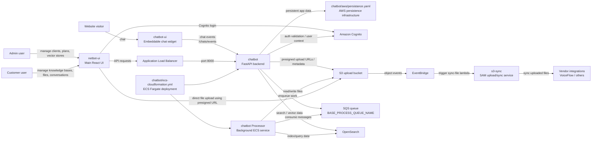
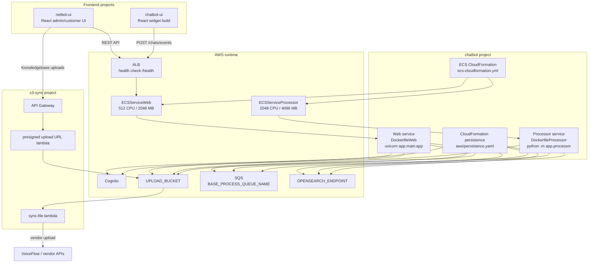
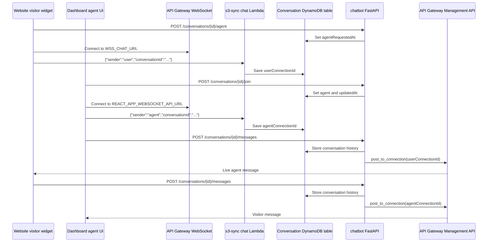
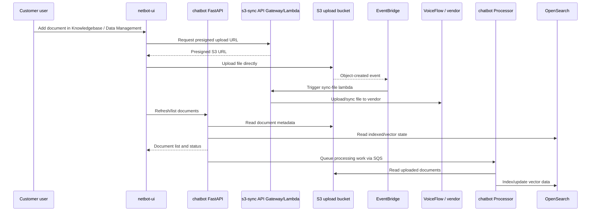

# Chatbot Workspace Architecture

This workspace contains sibling projects under `/Users/alikianzadeh/git/`. The frontend apps, backend API, widget, and AWS upload/sync services are separate projects that integrate through HTTP APIs, Cognito authentication, S3 events, SQS, and external vendor APIs.

## System Context



## Runtime Services



## Live Agent WebSocket Flow

Live agent chat combines normal HTTP endpoints in `chatbot` with an API Gateway WebSocket API currently defined in the `s3-sync` project.



### Live Agent Components

- Widget WebSocket URL: `/Users/alikianzadeh/git/chatbot-ui/` uses `WSS_CHAT_URL`.
- Dashboard WebSocket URL: `/Users/alikianzadeh/git/netbot-ui/` uses `REACT_APP_WEBSOCKET_API_URL`.
- WebSocket registration Lambda: `/Users/alikianzadeh/git/s3-sync/chat/app.py`.
- Backend WebSocket sender: `/Users/alikianzadeh/git/chatbot/app/service/MessageService.py`.
- Live agent HTTP controller: `/Users/alikianzadeh/git/chatbot/app/controller/conversationController.py`.
- Live agent public routes: `/Users/alikianzadeh/git/chatbot/app/api/public_conversation.py`.

### Production Domain Contract

The widget, dashboard, and backend must all use the same API Gateway WebSocket custom domain.

- Production WebSocket domain: `chat.netbot.jp`.
- Older/separate WebSocket domain: `chat.chishiki.link` from the `sync-s3-vs` stack.
- Backend ECS env var: `APIGATEWAY_DOMAIN_NAME` must match the frontend WebSocket domain.
- GitHub Actions passes this into `chatbot/ecs-cloudformation.yml` from `chatbot/.github/workflows/main.yml` using the CloudFormation parameter `ApiGatewayDomainName`.
- WebSocket Lambda env var: `DYNAMODB_CONVERSATION_TABLE` must point at the backend's conversation table for the same environment. Prod must use `chatbot-prod-conversation`; dev uses `chatbot-dev-conversation`.
- The prod `s3-sync` SAM deploy config must pass `ConversationTable=chatbot-prod-conversation`. If omitted, `s3-sync/template.yaml` defaults to `chatbot-dev-conversation`, so prod WebSocket registrations are written into the dev table and prod live messages are lost.

If the browser connects to `chat.netbot.jp` but the backend posts via `chat.chishiki.link`, HTTP requests can still return `200`, but live messages will not arrive because the connection IDs belong to a different API Gateway WebSocket API.

When debugging live-agent delivery, verify:

- Browser Network tab shows a WebSocket `101` to the expected domain.
- WebSocket Lambda logs show both `sender:"user"` and `sender:"agent"` for the same `conversationId`.
- WebSocket Lambda env has `DYNAMODB_CONVERSATION_TABLE=chatbot-prod-conversation` in prod.
- The conversation DynamoDB row has `userConnectionId` and `agentConnectionId`.
- ECS task env has `APIGATEWAY_DOMAIN_NAME=chat.netbot.jp`.
- Backend logs do not show missing `ConnectionId` or posting to the wrong API Gateway domain.

## Support Ticket Flow

Support tickets are created by the normal chatbot response path in `chatbot`; they are separate from the live-agent WebSocket handoff flow.

```mermaid
sequenceDiagram
    participant Visitor as Website visitor
    participant Widget as chatbot-ui widget
    participant API as chatbot FastAPI
    participant NetBot as NetBot agent flow
    participant LLM as LLM classifier
    participant Conv as Conversation table
    participant Ticket as Support ticket table
    participant UI as netbot-ui

    UI->>API: Configure agent supportTicketPrompt
    API->>Ticket: No ticket yet; prompt saved on AgentModel

    Visitor->>Widget: Asks for help / requests a ticket
    Widget->>API: POST /chats/events
    API->>NetBot: Process message with agent config
    NetBot->>LLM: Classify normal / offer_ticket / open_ticket

    alt User appears blocked or dissatisfied
        NetBot-->>Widget: Would you like me to open a support ticket?
    else User requests or accepts a ticket without email
        NetBot->>Conv: Save supportTicketState=awaiting_email
        NetBot-->>Widget: Ask for follow-up email
    else User requests or accepts a ticket with email
        NetBot->>Ticket: Create open chatbot support ticket
        NetBot->>Conv: Save supportTicketRequesterEmail
        NetBot-->>Widget: Confirm ticket number
    end
```

### Support Ticket Components

- Agent prompt field: `supportTicketPrompt`.
- Admin agent configuration UI: `/Users/alikianzadeh/git/netbot-ui/src/components/AdminAgentForm.js`.
- Customer agent configuration UI: `/Users/alikianzadeh/git/netbot-ui/src/components/Agents.js`.
- Agent persistence: `/Users/alikianzadeh/git/chatbot/app/model/AgentModel.py`.
- Agent API view/controller: `/Users/alikianzadeh/git/chatbot/app/view/Agent.py` and `/Users/alikianzadeh/git/chatbot/app/controller/AgentController.py`.
- Runtime classifier and ticket flow: `/Users/alikianzadeh/git/chatbot/app/vendor/NetBot.py`.
- Ticket controller/model/view: `/Users/alikianzadeh/git/chatbot/app/controller/SupportTicketController.py`, `/Users/alikianzadeh/git/chatbot/app/model/SupportTicketModel.py`, and `/Users/alikianzadeh/git/chatbot/app/view/SupportTicket.py`.
- Customer ticket routes: `/Users/alikianzadeh/git/chatbot/app/api/private_support_ticket.py`, mounted at `/private/support-tickets`.
- Admin ticket routes: `/Users/alikianzadeh/git/chatbot/app/api/admin_support_ticket.py`, mounted at `/admin/clients/{clientId}/support-tickets`.
- Infrastructure: `/Users/alikianzadeh/git/chatbot/aws/persistence.yaml` defines `${EnvName}-support-ticket`.

### Support Ticket Data Contract

The support-ticket table uses `clientId` as the partition key and `supportTicketId` as the sort key. Ticket IDs are per-client numeric sequence values; the counter is stored in the same table using `supportTicketId="__counter__"`.

Created tickets include:

- `clientId`
- `supportTicketId`
- `createdAt` and `updatedAt`
- `createdBy`
- `agentId`
- `chatbotId`
- `conversationId`
- `requesterEmail`
- `title`
- `description`
- `status` (`open` when created)
- `source` (`chatbot` when created by the bot)

Conversation rows can temporarily hold `supportTicketState`, `supportTicketIssueSummary`, and `supportTicketRequesterEmail` while the bot is waiting for the user's email address.

## Knowledge Base Upload Flow



## Notes

- `netbot-ui` is the main authenticated React UI for admins, customers, and members.
- `chatbot-ui` is the embeddable chatbot widget and calls the backend `/chats/events` API.
- `chatbot` deploys as two ECS Fargate services: `Web` for FastAPI and `Processor` for background SQS work.
- `s3-sync` is currently a separate SAM project and is being migrated into `chatbot`.
- Backend API contract changes in `chatbot` should be reflected in `netbot-ui` and/or `chatbot-ui` when needed.
