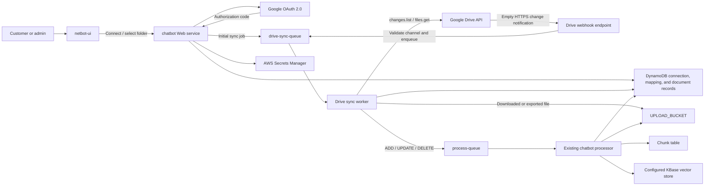
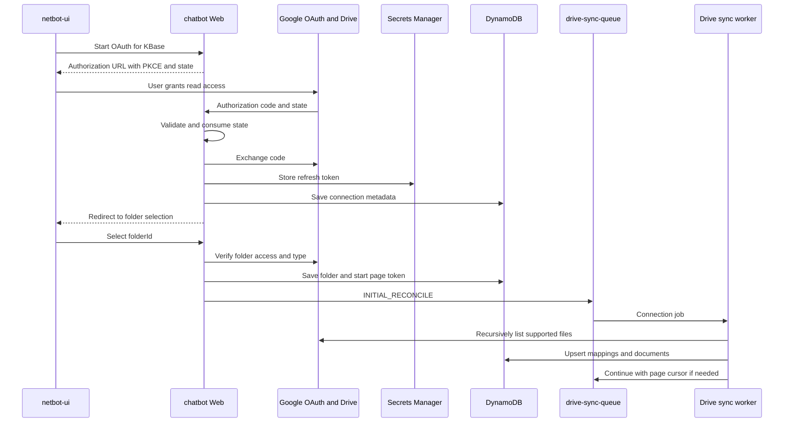

# Google Drive to KBase Architecture

## Goal

Allow a customer to connect a Google Drive folder to one KBase. Supported files in that folder are imported into the existing KBase document pipeline and kept synchronized when files are added, changed, moved, trashed, or access is revoked.

This design belongs in the `chatbot` backend and `netbot-ui`. It must not extend the legacy vendor-oriented ingestion flow in `s3-sync`; that project is being migrated into `chatbot`.

## Architecture Decision

Google Drive is a source adapter, not a second vector-ingestion system.

The Drive integration discovers changes and materializes each supported Drive file in the existing `UPLOAD_BUCKET`. It then publishes the existing per-document processing work to `${EnvName}-process-queue`. The current processor remains responsible for parsing, chunking, storing chunks, generating previews, and replacing vectors.

Use a separate `${EnvName}-drive-sync-queue` for connection- and folder-level reconciliation. A Drive notification only says that changes exist; it does not contain the changed file. The Drive sync worker consumes the notification, calls `changes.list`, filters changes to the connected folder, and emits ordinary document-processing messages.



## Component Ownership

### `netbot-ui`

Add Google Drive controls to the KBase documents screen:

- Connect Google Drive.
- Display the connected Google account and selected folder.
- Show connection state: `connecting`, `syncing`, `active`, `reauthorization_required`, `error`, or `disconnected`.
- Allow “Sync now”, change folder, and disconnect.
- Display Drive source metadata and last synchronization result on imported documents.

The browser never receives or stores a Google refresh token. It starts OAuth through the backend and only receives connection status.

### `chatbot` Web service

Add authenticated connection-management routes and one public Google callback surface:

- Start and complete OAuth.
- Save the selected folder and initiate the first reconciliation.
- Return connection and sync status.
- Request an on-demand reconciliation.
- Disconnect and optionally remove imported documents.
- Receive Google Drive notification headers and enqueue a lightweight sync job.

The webhook must validate the channel identifier and channel token, enqueue work, and return `204` immediately. It must not call Drive, download files, or process vectors synchronously.

### Drive sync worker

Add a separate worker command in the `chatbot` project, using the same application image where practical. Its responsibilities are:

- Refresh an expired Google access token using the encrypted refresh token.
- Run initial folder discovery.
- Consume the Drive change log from the stored page token.
- Determine whether a changed file is in the connected folder scope.
- Export Google Workspace files or download binary files.
- Write source objects to S3.
- create/update Drive-to-KBase document mappings.
- Publish idempotent `ADD`, `UPDATE`, and `DELETE` document jobs.
- Advance the Drive page token only after the corresponding changes have been durably recorded.
- Renew expiring notification channels.

Deploy it as a distinct ECS service consuming `${EnvName}-drive-sync-queue`. Isolation prevents Drive API delays or rate limits from blocking the existing document processor.

### Existing document processor

The processor continues to consume `${EnvName}-process-queue`. Drive files use the same S3 layout and stable KBase `documentId`, so an update replaces that document's chunks and vectors instead of creating a duplicate.

Before implementation, make file updates as atomic as the URL update path: parse the new source first, then replace old chunks and vectors. A failed refresh must leave the last successfully indexed version searchable and mark the attempted source version as failed.

## Authentication and Authorization

Use the OAuth 2.0 web-server authorization-code flow with:

- PKCE.
- A random, single-use `state` value bound to `clientId`, `kbaseId`, intended redirect, and a short expiration.
- Offline access so the worker can refresh tokens without the user being present.
- An exact allowlist of callback and post-OAuth redirect URLs.

Recommended initial Drive scope:

```text
https://www.googleapis.com/auth/drive.readonly
```

This permits continuous read access to a selected existing folder and its current/future contents, but it is a broad restricted scope and can increase Google verification requirements. Before development, validate whether Google Picker plus `drive.file` satisfies future-child and Shared Drive behavior for the product. Prefer `drive.file` if those tests prove it sufficient; otherwise retain `drive.readonly` and complete the required verification/security review.

Store the refresh token in AWS Secrets Manager under an environment-specific secret. DynamoDB stores only the secret ARN/name and non-secret token metadata. Do not put OAuth tokens in DynamoDB, logs, URLs, SQS messages, notification channel tokens, or frontend storage.

An optional enterprise phase can support a service account with Google Workspace domain-wide delegation. It must be a separate connection mode, require Workspace administrator setup, and impersonate a configured user. It is not required for the first release.

## Data Model

### New `${EnvName}-drive-connection` table

Partition key: `connectionId`.

Suggested attributes:

| Attribute | Purpose |
| --- | --- |
| `connectionId` | Stable UUID |
| `clientId` | Tenant owner |
| `kbaseId` | Target KBase |
| `googleSubject` | Stable Google account subject, not email identity |
| `googleEmail` | Display and support use only |
| `folderId` | Selected Drive folder |
| `folderName` | Cached display name |
| `driveId` | Shared Drive ID when applicable |
| `secretRef` | Secrets Manager reference for refresh token |
| `scope` | Granted OAuth scopes |
| `status` | Connection lifecycle state |
| `startPageToken` | Next Drive change-log cursor |
| `channelId` | Current notification channel ID |
| `channelResourceId` | Required to stop the channel |
| `channelTokenHash` | Hash of the random webhook verification token |
| `channelExpiresAt` | Renewal deadline |
| `lastSyncStartedAt` | Operational visibility |
| `lastSyncCompletedAt` | Operational visibility |
| `lastErrorCode` | Sanitized actionable error |
| `createdAt`, `updatedAt` | Audit timestamps |

Add a GSI keyed by `kbaseId` so KBase deletion and UI lookup do not scan the table. Enforce one active connection per KBase in the service layer for the first release.

### New `${EnvName}-drive-file-mapping` table

Partition key: `connectionId`; sort key: `driveFileId`.

Suggested attributes:

| Attribute | Purpose |
| --- | --- |
| `documentId` | Stable existing KBase document identifier |
| `name` | Latest Drive filename |
| `mimeType` | Drive source MIME type |
| `exportMimeType` | Format materialized to S3 |
| `modifiedTime` | Source modification time |
| `sourceVersion` | Drive `version` when supplied |
| `md5Checksum` | Binary-file checksum when supplied |
| `parents` | Parent IDs needed for folder-scope evaluation |
| `s3Key` | Current materialized object |
| `syncStatus` | Per-file sync state |
| `lastSyncedAt` | Last successful index handoff |
| `removedAt` | Tombstone timestamp |

This compound key makes `(connectionId, driveFileId)` the idempotency boundary. Replaying a notification updates the same mapping and `documentId`.

### Extend the existing document record

Add optional source fields to `DocumentModel` and the API view:

- `sourceType = "google_drive"`
- `sourceConnectionId`
- `sourceFileId`
- `sourceModifiedTime`
- `sourceVersion`
- `sourceWebViewLink`
- `lastSyncError`

Keep `documentId`, `kbaseId`, `folder`, `status`, `chunkCount`, and the existing vector prefix contract unchanged.

Do not store Google folders as normal KBase `folder` documents during the first release. Treat the selected Drive folder as a source boundary and map its relative path into the existing `folder` string for UI organization.

## API Contract

All private routes use the existing Cognito authentication and verify that the authenticated tenant owns the KBase.

| Method | Route | Purpose |
| --- | --- | --- |
| `POST` | `/private/kbases/{kbaseId}/integrations/google-drive/oauth/start` | Return a Google authorization URL |
| `GET` | `/integrations/google-drive/oauth/callback` | Validate state, exchange code, and redirect to UI |
| `PUT` | `/private/kbases/{kbaseId}/integrations/google-drive/folder` | Save a selected folder and start initial sync |
| `GET` | `/private/kbases/{kbaseId}/integrations/google-drive` | Return sanitized connection/sync state |
| `POST` | `/private/kbases/{kbaseId}/integrations/google-drive/sync` | Enqueue manual reconciliation |
| `DELETE` | `/private/kbases/{kbaseId}/integrations/google-drive` | Disconnect; explicit body chooses whether indexed documents are retained |
| `POST` | `/webhooks/google-drive` | Receive Drive channel notifications |

The OAuth callback consumes the one-time state but should not accept `kbaseId` or `clientId` from unsigned query parameters.

## Synchronization Flows

### Initial connection



Capture `changes.getStartPageToken` before or as part of the initial enumeration. After enumeration, drain `changes.list` from that token so edits made during the initial scan are not lost.

### Incremental update

1. Google sends an empty notification to `/webhooks/google-drive`.
2. The API validates `X-Goog-Channel-Id` and the constant-time hash comparison of `X-Goog-Channel-Token`.
3. The API deduplicates on `(channelId, X-Goog-Message-Number)` where available and enqueues `INCREMENTAL_RECONCILE`.
4. The worker calls `changes.list` with the stored page token until all pages are consumed.
5. For each relevant file, the worker compares `version`, `modifiedTime`, and checksum/export metadata with the mapping.
6. Changed content is downloaded/exported to S3, the document record is updated, and `Action.UPDATE` is sent to the normal process queue.
7. The worker stores `newStartPageToken` only after all discovered work is durably represented.

Notifications are hints and may be duplicated or coalesced. Correctness comes from the Drive change log plus a periodic full reconciliation, not from notification count.

### Delete, move, and lost access

- Trashed, permanently deleted, or unshared file: enqueue the existing document `DELETE`, remove chunks/vectors and materialized S3 objects, then retain a mapping tombstone for a configurable period.
- File moved outside the selected folder tree: treat it as removal from this connection.
- File moved into the selected folder tree: import it.
- Folder renamed or moved: keep identity by `folderId`; refresh the displayed relative path.
- `401` or `invalid_grant`: set `reauthorization_required`, stop normal retries, and notify the UI.
- `403` for one file: mark that file inaccessible; do not disable the entire connection unless folder/root access is lost.
- Disconnect: stop the notification channel, delete/revoke the stored token, mark the connection disconnected, and apply the user's explicit retain-or-delete choice.

## File Handling

First-release source formats should match the existing processor:

| Drive source | Materialized format | Existing processor |
| --- | --- | --- |
| PDF | `.pdf` | PDF path, including optional OCR |
| Microsoft Word / Google Docs | `.docx` | DOCX path |
| CSV | `.csv` | CSV path |
| Google Sheets | `.xlsx` after adding XLSX parsing, or one CSV per sheet | New work required |
| Google Slides / PowerPoint | `.pptx` after adding PPTX parsing, or PDF with an explicit extraction policy | New work required |

For the minimum viable release, accept PDF, DOCX/Google Docs, and CSV only. Unsupported files remain visible in sync results with `unsupported_type`; they are not silently treated as successfully indexed.

Google Workspace files must use `files.export`; binary files use `files.get` with media download. The worker must request only needed fields and set `supportsAllDrives=true` for operations that support Shared Drives. Listing logic must handle pagination, shortcuts, Google-native MIME types, Shared Drive corpora, and export-size/API limitations.

Use this S3 key contract:

```text
documents/{kbaseId}/{documentId}/{sourceVersion}/{safeFilename}
```

Write to a versioned key, validate the object, and only then update the mapping's active `s3Key`. Apply an S3 lifecycle rule to remove superseded source versions after the rollback window.

## Reliability and Idempotency

- SQS delivery is at least once. Every handler must be replay-safe.
- Use a conditional update or lease on each connection so only one reconciliation advances its page token at a time.
- Coalesce queued webhook jobs by `connectionId`; one reconciliation drains all available changes.
- Use `(connectionId, driveFileId, sourceVersion)` as the content-ingestion idempotency key.
- Never advance a page token before changes are committed to mappings or durable follow-up jobs.
- Configure a DLQ for both Drive sync and document processing queues.
- Retry `429` and transient `5xx` responses with exponential backoff and jitter, honoring `Retry-After`.
- Periodically run a full folder reconciliation (recommended daily) to repair missed notifications, membership changes, or expired channels.
- Renew `changes.watch` before `channelExpiresAt`. Drive does not renew channels automatically.
- Stop the old channel after the replacement is active; tolerate an overlap window.
- Put a maximum file size, total connection quota, supported MIME allowlist, and sync batch limit in server-side configuration.

The existing `ProcessorManager.addFile` currently appends chunks/vectors and is not safe for replayed `UPDATE` jobs. Drive support requires update semantics equivalent to `addUpdateUrl`: remove or replace prior chunks and vector entries for the stable document prefix only after the new file has been parsed successfully.

## Security

- Authorize every connection operation against both `clientId` and `kbaseId`; never trust identifiers from OAuth state after state verification has failed.
- Encrypt refresh tokens with a customer-managed KMS key through Secrets Manager.
- Restrict the Web and Drive worker task roles separately. Only the worker needs read access to the token secret and write access to Drive source S3 prefixes.
- Store a random high-entropy channel token per channel and compare its hash in constant time.
- Treat webhook headers as untrusted input. Reject unknown channels, oversized headers, invalid tokens, and unexpected methods.
- Do not include email addresses, file names, access tokens, or document contents in routine logs.
- Sanitize Drive filenames before creating temporary files or S3 keys; Drive IDs remain the authoritative identity.
- Virus/malware-scan downloaded binary content before parsing if customer uploads are subject to the same control.
- Record auditable connect, reauthorize, folder-change, sync, and disconnect events.
- Revoke the Google grant when the customer explicitly requests full revocation; deleting the local connection alone is not equivalent.

## AWS Infrastructure Changes

Add to `chatbot/aws/persistence.yaml`:

- `${EnvName}-drive-connection`.
- `${EnvName}-drive-file-mapping`.
- `${EnvName}-drive-sync-queue` and DLQ.
- Required GSIs and TTL attributes for OAuth state/deduplication if those are stored in DynamoDB.

Add to `chatbot/ecs-cloudformation.yml`:

- Drive sync ECS task/service using the processor image with a dedicated command such as `python -m app.drive_sync_worker`.
- Least-privilege permissions for Drive tables, sync queue, token secrets, S3 source prefix, normal process queue, and KMS.
- EventBridge schedule for daily full reconciliation.
- EventBridge schedule or worker logic for notification-channel renewal.
- Environment variables for OAuth client ID, OAuth client secret reference, callback URL, webhook URL, queue names, size limits, and supported MIME types.

Store the OAuth client secret in Secrets Manager, not CloudFormation parameters, source control, container images, or GitHub Actions plaintext.

## Observability

Emit structured metrics by environment and connection, without customer content:

- OAuth completion/failure count.
- Active and reauthorization-required connections.
- Webhook accepted/rejected count and enqueue latency.
- Reconciliation duration, changes read, files added/updated/deleted/skipped.
- Download/export bytes and latency.
- Drive API `401`, `403`, `429`, and `5xx` count.
- Page-token age and notification-channel time to expiration.
- Queue age/depth and DLQ count.
- Document processing success/failure and end-to-end source-to-search latency.

Alert on expired channels, stale page tokens, repeated `invalid_grant`, DLQ messages, sustained Drive throttling, and connections that have not completed a successful reconciliation within their expected interval.

## Delivery Plan

### Phase 1: Foundation

- Add OAuth connection lifecycle, secret storage, connection tables, and UI status.
- Select one folder.
- Run manual/initial recursive sync for PDF, DOCX/Google Docs, and CSV.
- Reuse the existing S3, SQS, chunk, and vector pipeline.
- Add idempotent stable document mappings and safe file-update semantics.

### Phase 2: Continuous synchronization

- Add `changes.watch`, webhook validation, `changes.list`, channel renewal, and daily reconciliation.
- Implement delete/move/unshare behavior.
- Add retries, leases, DLQs, metrics, and operational alerts.

### Phase 3: Expanded content and administration

- Add Sheets, Slides, and shortcuts after their parsing/export behavior is defined.
- Add Shared Drive validation and enterprise domain-wide-delegation mode.
- Add per-connection quotas, detailed sync reports, audit UI, and bulk repair tools.

## Acceptance Criteria

- A tenant cannot connect Drive to or inspect another tenant's KBase.
- Connecting a folder imports each supported file exactly once.
- Editing a Drive file updates the same KBase document and does not leave duplicate vectors.
- Adding, moving, trashing, restoring, or unsharing a file converges to the correct KBase state.
- Duplicate and out-of-order webhook/SQS delivery does not corrupt mappings or duplicate chunks.
- A failed update leaves the last successfully indexed content searchable.
- Token revocation becomes `reauthorization_required` without a retry storm.
- Shared Drive files behave correctly when enabled.
- Disconnect stops notifications and applies an explicit retain-or-delete choice.
- All secrets are encrypted and absent from browser storage, DynamoDB payload fields, logs, and queues.
- Missed notifications are repaired by periodic reconciliation.

## Current Code Reused

- KBase and document APIs: `chatbot/app/api/private_kbase.py` and `chatbot/app/api/private_document.py`.
- Document creation and S3 key handling: `chatbot/app/controller/DocumentController.py`.
- Document metadata: `chatbot/app/model/DocumentModel.py`.
- Queue contract: `chatbot/app/sqs/ProcessDocument.py` and `chatbot/app/sqs/QueuePublisher.py`.
- Parsing and vector ingestion: `chatbot/app/chunk/ProcessorManager.py`.
- Background consumer: `chatbot/app/processor.py`.
- Periodic scheduling precedent: `chatbot/app/refresh_scheduler.py`.
- KBase UI and client API: `netbot-ui/src/components/KbaseDocuments.js` and `netbot-ui/src/services/KbaseService.js`.

## Google API References

- [OAuth 2.0 for web server applications](https://developers.google.com/identity/protocols/oauth2/web-server)
- [OAuth 2.0 security best practices](https://developers.google.com/identity/protocols/oauth2/resources/best-practices)
- [Retrieve Drive changes](https://developers.google.com/workspace/drive/api/guides/manage-changes)
- [Drive push notifications](https://developers.google.com/workspace/drive/api/guides/push)
- [Google Workspace export MIME types](https://developers.google.com/workspace/drive/api/guides/ref-export-formats)
