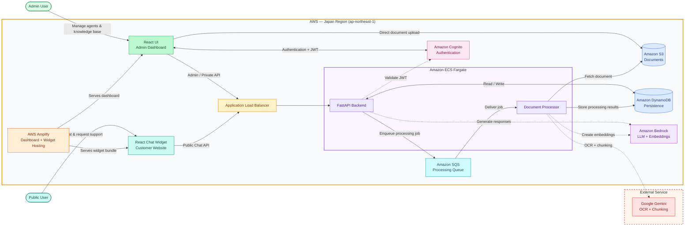

# NetBot Architecture

> [!IMPORTANT]
> Google Gemini is outside AWS. Before sending customer documents to it, verify that its configured endpoint stores and processes all data exclusively in Google Cloud's Japan region (`asia-northeast1`).
